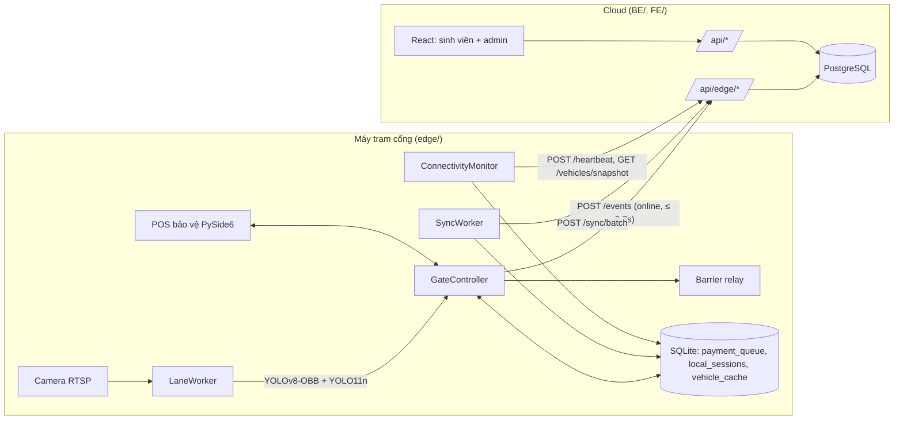

# eParking: kiến trúc Edge-Cloud Hybrid

Nhận diện biển số và điều khiển barrier chạy **tại máy trạm cổng (Edge)**. Web/Backend (**Cloud**) chỉ quản lý dữ liệu: tài khoản, ví, phiên gửi xe, báo cáo. Cổng vẫn hoạt động khi mất Internet; sự kiện được đồng bộ lại khi có mạng.



## 1. Phân tách trách nhiệm

| | Edge (máy trạm) | Cloud (Web + API) |
|---|---|---|
| Camera, AI, barrier | ✅ | ❌ đã xóa (ml_service, Socket.IO :5001, trang camera, Python khỏi image backend) |
| Quyết định mở cổng khi online | gửi sự kiện, thực thi kết quả | ✅ kiểm tra nợ/số dư, trừ phí |
| Quyết định khi offline | ✅ tự chủ, không chặn xe đã đăng ký | nhận lại qua batch sync |
| Dữ liệu chuẩn (ví, phiên, giao dịch) | cache + hàng chờ | ✅ nguồn sự thật |

## 2. Lược đồ PostgreSQL (Prisma, `BE/prisma/schema.prisma`)

Migration: `BE/prisma/migrations/20260925000000_edge_cloud_hybrid`.

- **`Wallet.balance`**: `Decimal(12,2)`, **cho phép âm** (nợ cước). Không có ràng buộc `>= 0`.
- **`EdgeDevice`** (thay `Camera`): `code`, `name`, `lane` (IN/OUT/BOTH), `lot_id`, `api_key_hash` (SHA-256, key gốc chỉ hiện 1 lần), `status` (active/revoked), `last_seen_at`, `pending_events`, `app_version`.
- **`EdgeEvent`**: sổ cái idempotency. PK = `event_id` (UUID do Edge sinh). Mỗi sự kiện chỉ được áp dụng **một lần**; retry trả `DUPLICATE` kèm kết quả gốc.
- **`ParkingSession`** thêm: `entry_event_id`/`exit_event_id` (unique), `entry_device_id`/`exit_device_id`, `entry_image_url`/`exit_image_url`, `entry_source`/`exit_source` (`ONLINE` | `OFFLINE_SYNC` | `MANUAL`), `entry_missing` (phiên đối soát khi có RA mà thiếu VÀO), `closed_reason`, `override_by`.
- **`Transaction`** thêm: `session_id` (1-1 với phiên), `overdraft` (giao dịch làm số dư < 0).
- **`Alert.device_id`** thay `camera_id`.

## 3. Lược đồ SQLite trên Edge (`edge/eparking_edge/local_db.py`)

- **`payment_queue`**: outbox cho **mọi** sự kiện ra/vào (check-in cũng cần lên Cloud để mở phiên). Ghi xuống đĩa **trước** khi gọi mạng.
  Cột chính: `event_id`, `event_type`, `lane`, `plate`, `plate_key`, `event_time`, `entry_time`, `fee`, `plate_image_path`, `frame_image_path`, `decision`, `decided_by` (CLOUD/OFFLINE/GUARD), `override_by`, `sync_status`, `attempts`, `next_attempt_at`, `last_error`, `cloud_result`.
- **`local_sessions`**: xe đang ở trong bãi theo góc nhìn trạm này (để tính giờ vào khi offline).
- **`vehicle_cache`**: snapshot xe đã đăng ký + trạng thái nợ, làm mới mỗi 5 phút.

Vòng đời `sync_status`:

```
DECIDING ──Cloud OPEN──────────────────▶ SYNCED
   │     ──Cloud chặn (nợ/không đủ)─────▶ BLOCKED ──bảo vệ override──▶ SYNCED | PENDING_SYNC
   │     ──xe chưa đăng ký──────────────▶ REJECTED ─override──▶ PENDING_SYNC | LOCAL_ONLY
   └─────mất mạng / timeout / 5xx──────▶ PENDING_SYNC ──SyncWorker──▶ SYNCED | REJECTED
```
App tắt khi đang `DECIDING` → lần khởi động sau chuyển `BLOCKED` để đối soát tay (không biết xe đã qua hay chưa).

## 4. Hợp đồng API Edge ↔ Cloud

Xác thực: header `Authorization: Device <api_key>`. Cấp key: `node scripts/edge-device.js create --code GATE-A --name "Cổng A" --lane BOTH --lot 1`.

### Payload sự kiện (dùng chung cho online và batch)

```json
{
  "event_id": "5b1f3c1e-8a52-4d7e-9a0e-2a4f6f1c9d10",
  "type": "CHECK_OUT",
  "plate": "49G1-11111",
  "event_time": "2026-09-25T07:31:02.114Z",
  "entry_time": "2026-09-25T01:02:40.000Z",
  "fee": 2000,
  "confidence": 0.91,
  "lane": "OUT",
  "override": { "by": "Bảo vệ A", "reason": "Hứa nạp tiền" },
  "images": { "plate": "<jpeg base64>", "frame": "<jpeg base64, ≤ 960px>" }
}
```
`entry_time`, `fee`, `override`, `images` là tùy chọn. Biển số được so khớp theo `plate_key` (bỏ mọi ký tự không phải A-Z0-9), nên `49G1-11111` = `49G111111`.

### Endpoints

| Method | Path | Mục đích |
|---|---|---|
| POST | `/api/edge/heartbeat` | `{app_version, pending_events}` → `{server_time, fee_per_turn, device}` |
| GET | `/api/edge/vehicles/snapshot` | Cache offline: `[{plate, plate_key, owner_name, mssv, balance, in_debt}]` |
| POST | `/api/edge/events` | **Online**: xe đang đứng ở cổng, Cloud quyết định |
| POST | `/api/edge/sync/batch` | `{events: [...]}` (≤ 100), xử lý tuần tự theo `event_time` |

### Kết quả (`code`)

| code | decision | Edge xử lý |
|---|---|---|
| `ACCEPTED` | OPEN | mở barrier, `SYNCED` |
| `DUPLICATE` | theo gốc | `SYNCED` (Cloud đã xử lý trước đó, vd response bị mất) |
| `BLOCKED_DEBT` | DENY | cảnh báo đỏ, chờ override. **Chỉ có ở online** |
| `BLOCKED_INSUFFICIENT` | DENY | như trên (khi RA, số dư < phí) |
| `REJECTED_UNKNOWN_VEHICLE` | DENY | xe chưa đăng ký; ở batch: ghi sổ cái + tạo Alert, không retry |
| `REJECTED_INVALID` | DENY | payload sai, không retry |
| `ERROR` | – | lỗi tạm thời, retry với backoff |

Ví dụ phản hồi online:
```json
{ "event_id": "…", "code": "ACCEPTED", "decision": "OPEN", "action": "SESSION_CLOSED",
  "session_id": 812, "fee": 2000, "balance_after": -1000, "overdraft": true,
  "owner": { "name": "Nguyễn Văn An", "mssv": "2212375", "balance": -1000, "debt": 1000 },
  "warnings": ["Số dư âm -1.000₫"] }
```

## 5. Quy tắc nghiệp vụ

**Online (`/events`)**
- Số dư < 0 → `BLOCKED_DEBT` cho cả VÀO lẫn RA.
- RA mà số dư < phí → `BLOCKED_INSUFFICIENT`.
- Kết quả BLOCKED **không ghi sổ cái**, nên bảo vệ gửi lại **cùng `event_id`** kèm `override` → Cloud trừ phí (cho phép âm), phiên có `source = MANUAL`, `override_by`.

**Batch sync (`/sync/batch`), thấu chi**
- Không bao giờ chặn: `Balance_new = Balance_old − Fee`, có thể < 0; giao dịch đánh dấu `overdraft = true` và tạo Alert "Nợ cước".
- Phí = `min(fee Edge đã hiển thị, biểu phí hiện hành)`: thiết bị không thể thu cao hơn biểu phí.
- Sắp xếp theo `event_time` trước khi áp dụng.

**Đối soát lệch thứ tự / mất sự kiện**
- RA không có phiên mở → tạo phiên `entry_missing = true`; khi sự kiện VÀO tương ứng đến sau sẽ gắn vào phiên đó.
- VÀO khi xe còn phiên mở cũ → đóng phiên cũ với `closed_reason = AUTO_CLOSED_MISSING_EXIT`, phí 0, để admin rà soát; không chặn xe.

**Đồng thời**: `EdgeEvent` được insert đầu tiên trong transaction; request trùng song song dính unique violation → trả `DUPLICATE`. Trừ ví bằng `UPDATE … balance = balance - fee` nguyên tử. Integration test xác nhận 4 request cùng `event_id` chỉ trừ tiền 1 lần.

## 6. Hành vi Edge

- **Online**: ghi outbox → `POST /events` với timeout kết nối 0.3s và đọc 0.7s. Quá hạn / 5xx / mất mạng → xử lý như offline cho **đúng xe đó** (mở cổng, `PENDING_SYNC`), không để xe chờ.
- **Offline** (heartbeat lỗi `failures_before_offline` lần liên tiếp): xe có trong `vehicle_cache` luôn được mở, xe đang nợ chỉ hiện cảnh báo vàng. Xe không có trong cache → chặn, chờ bảo vệ (cấu hình `offline_open_unknown: true` để luôn mở).
- **SyncWorker**: khi online, lấy tối đa 50 bản ghi `PENDING_SYNC` đến hạn, gửi batch. Lỗi mạng → backoff mũ toàn worker (2s → 300s, jitter ±20%). Lỗi từng bản ghi → `attempts++`, `next_attempt_at` theo backoff.
- **AI**: model nạp 1 lần (singleton) + warm-up; ROI cắt vùng làn; OBB được warp phối cảnh trước khi đưa vào YOLO11n; `verbose=False`; chỉ xử lý khung mới nhất (không tích lũy buffer RTSP). Biển số được chốt khi cùng kết quả ở `confirm_frames` khung liên tiếp; cooldown 20s/biển/làn chống sự kiện lặp.
- **Hậu xử lý** (`ai/postprocess.py`): 2 dòng nếu `Δy > 0.3·H` và `n ≥ 4`; tách theo `y_mid = mean(y)`; ghép `top + "-" + bottom`.

### Ngân sách độ trễ ≤ 300 ms (mục tiêu)
| Bước | CPU i5 (ước lượng) | GPU |
|---|---|---|
| OBB detect 640px | 60-120 ms | 8-15 ms |
| Warp + YOLO11n 320px | 15-40 ms | 3-6 ms |
| Cloud `/events` | 30-80 ms (đo local: 30-55 ms) | – |
| Relay | < 20 ms | – |

Với `confirm_frames: 2` cộng thêm 1 chu kỳ suy luận; đặt `1` nếu camera góc tốt. Số liệu CPU/GPU là ước lượng, cần đo trên máy trạm thật (UI hiển thị ms mỗi khung và độ trễ mỗi quyết định).

## 7. Vận hành

```bash
# Cloud
docker compose up -d --build
docker compose exec backend node scripts/edge-device.js create --code GATE-A --name "Cổng bãi A" --lane BOTH --lot 1
docker compose exec backend node scripts/edge-device.js list      # rotate / revoke

# Edge (Windows, Python 3.10-3.12)
cd edge && python -m venv .venv && .venv\Scripts\activate
pip install -r requirements.txt
copy config.example.yaml config.yaml   # điền base_url, device_key, RTSP
python main.py                          # hoặc --no-ai để thử luồng mà không cần camera
```

Kiểm thử: `cd edge && python -m pytest` (logic Edge, không cần mạng) · `cd BE && DATABASE_URL=<db test> npm run test:edge` (integration với Postgres thật).

## 8. Giới hạn đã biết

- **API web chưa có xác thực token** (có từ trước, không thuộc phạm vi thay đổi này): các endpoint `/api/admin/*` đang mở. Vì vậy key thiết bị chỉ cấp qua CLI trên server, không qua web. Nên bổ sung JWT trước khi đưa lên Internet.
- Ảnh bằng chứng phục vụ tĩnh tại `/evidence/...` với tên file là UUID ngẫu nhiên (khó đoán nhưng không có kiểm soát truy cập).
- Thời gian sự kiện lấy từ đồng hồ máy trạm: cần bật đồng bộ NTP.
- Biểu phí hiện là phí cố định mỗi lượt (`fee_per_turn`); nếu tính theo giờ, dùng `entry_time`/`event_time` đã có trong payload.
- Ảnh bằng chứng trên Edge chưa có cơ chế tự dọn; nên xóa ảnh của bản ghi `SYNCED` cũ hơn N ngày.
